```mermaid
graph LR
    A[GitHub Actions Scheduler] -->|Daily 3AM UTC| B[Ubuntu Runner]
    B -->|Python Script| C[DGI Website]
    C -->|Download Excel| D[/tmp/dgi_downloads/]
    D -->|Google Drive API| E[Google Drive]
    E -->|Auto-Sync| F[Power BI / Looker Studio]
    F -->|Dashboard| G[End Users]
    
    style A fill:#2088FF,stroke:#333,stroke-width:2px,color:#fff
    style C fill:#009639,stroke:#333,stroke-width:2px,color:#fff
    style E fill:#1EA362,stroke:#333,stroke-width:2px,color:#fff
    style F fill:#F2C811,stroke:#333,stroke-width:2px,color:#000
```

```markdown
# 🇨🇲 DGI360 - Part 1: Automated Data Pipeline

[](https://github.com/clintintonifar/dgi-cameroon-automation/actions)
[](https://www.python.org/)
[](LICENSE)
[](../../actions)
[](../../commits)
[](../../)

> **Part 1 of DGI360**: Fully automated, cloud-based data pipeline for Cameroon DGI taxpayer compliance data  
> **Part 2**: 📊 Power BI Dashboard (Coming Soon)

---

## 🎯 Project Overview: DGI360

**DGI360** is a two-part project designed to provide end-to-end visibility into Cameroon taxpayer compliance:

```
┌─────────────────────────────────────────────────────────┐
│                    DGI360 Architecture                   │
├─────────────────────────────────────────────────────────┤
│                                                         │
│  PART 1: Data Pipeline (✅ THIS REPO)                   │
│  ┌─────────────────────────────────┐                   │
│  │ • Automated DGI data collection │                   │
│  │ • Daily sync via GitHub Actions │                   │
│  │ • Google Drive storage          │                   │
│  │ • 5-year rolling window         │                   │
│  └─────────────────────────────────┘                   │
│                          │                              │
│                          ▼                              │
│  PART 2: Power BI Dashboard (🔜 Coming Soon)           │
│  ┌─────────────────────────────────┐                   │
│  │ • Interactive taxpayer search   │                   │
│  │ • Compliance rate visualizations│                   │
│  │ • Monthly activity heatmaps     │                   │
│  │ • Export & reporting features   │                   │
│  └─────────────────────────────────┘                   │
│                                                         │
└─────────────────────────────────────────────────────────┘
```

---

## 🏛️ Understanding the DGI Cameroon Data Source

### What is the DGI Cameroon Portal?

The **Direction Générale des Impôts (DGI)** is Cameroon's national tax authority. Their public portal ([teledeclaration-dgi.cm](https://teledeclaration-dgi.cm)) publishes monthly lists of taxpayers who have fulfilled their tax declaration obligations.

### How the Data Publication Works

```
┌─────────────────────────────────────────────────────────┐
│                    DGI Publication Cycle                │
└─────────────────────────────────────────────────────────┘

[End of Month]
        │
        ▼
[DGI Internal Processing]
(Tax declarations validated, compliance status updated)
        │
        ▼
[File Generation]
(Excel file created: FICHIER_[MONTH]_[YEAR].xlsx)
        │
        ▼
[Portal Upload]
(File published to public archive section)
        │
        ▼
[Public Access]
(Anyone can download without authentication)
```

### Data File Structure

| Attribute | Details |
|-----------|---------|
| **File Format** | Microsoft Excel (.xlsx) |
| **File Naming** | `FICHIER_[MONTH]_[YEAR].xlsx` (e.g., `FICHIER_JANVIER_2026.xlsx`) |
| **Publication Timing** | Typically 1-2 weeks after month-end (variable) |
| **File Size** | ~15-40 MB depending on month |
| **Rows per File** | ~250,000 - 350,000 taxpayers |
| **Key Columns** | `NIU`, `RAISON_SOCIALE`, `SIGLE`, `CRI`, `CENTRE_DE_RATTACHEMENT`, `ACTIVITE_PRINCIPALE` |

### Key Data Fields Explained

| Column | Description | Example |
|--------|-------------|---------|
| **NIU** | Numéro d'Identification Unique – Unique taxpayer ID | `M051712627068Z` |
| **RAISON_SOCIALE** | Legal business name | `SOCIETE EXAMPLE SARL` |
| **SIGLE** | Business acronym/short name | `SE-SARL` |
| **CRI** | Centre des Recettes des Impôts – Tax office code | `CRI-001` |
| **CENTRE_DE_RATTACHEMENT** | Assigned tax collection center | `DOUALA BONANJO` |
| **ACTIVITE_PRINCIPALE** | Primary business activity code | `6201Z` (Software development) |

### Why Automate This Data Collection?

| Challenge | Manual Approach | Automated Solution |
|-----------|---------------|-------------------|
| **Variable Publication Dates** | Check website daily, risk missing updates | Daily cron job catches files within 24h |
| **Large File Sizes** | Manual download = slow, error-prone | Script handles retries, progress tracking |
| **Historical Analysis** | Manually organize 60+ files = tedious | Auto-maintains 5-year rolling window |
| **Data Freshness** | Dashboard stale until manual refresh | Daily automation ensures near real-time data |
| **Scalability** | One person = bottleneck | Cloud automation = zero human intervention |

---

## 📋 Executive Summary (Part 1)

This repository contains **Part 1 of DGI360**: the automated data collection pipeline that downloads, stores, and maintains taxpayer compliance data from Cameroon's DGI portal.

| Metric | Value |
|--------|-------|
| **Automation** | Daily at 03:00 UTC |
| **Data Sources** | DGI Cameroon (Official Government Portal) |
| **Storage** | Google Drive (15 GB Free Tier) |
| **Retention** | 5-Year Rolling Window (~60 files) |
| **Maintenance** | Zero (Fully Automated) |
| **Cost** | $0/month (100% Free Tier) |

---

## 🏗️ Architecture Overview



---

## ✨ Key Features

| Feature | Description | Benefit |
|---------|-------------|---------|
| **🤖 Fully Automated** | Daily cron schedule via GitHub Actions | Zero manual work |
| **🔄 Retry Logic** | 5 attempts per file with exponential backoff | Handles unreliable connections |
| **🗑️ Auto-Cleanup** | Deletes files older than 5 years automatically | Predictable storage usage |
| **🔐 Secure Credentials** | All secrets stored in GitHub Secrets | No credentials in code |
| **📊 Idempotent** | Skips already-downloaded files | No duplicates, efficient |
| **☁️ 100% Cloud** | No PC or local server required | Access from anywhere |
| **💰 Free Tier** | Uses GitHub Actions + Google Drive free tiers | $0/month forever |

---

## 📁 Repository Structure

```
dgi-cameroon-automation/
├── 📄 README.md                 # This file - Project documentation
├── 📄 LICENSE                   # MIT License - Open source
├── 📄 .gitignore                # Git ignore rules (credentials, temp files)
├── 📄 requirements.txt          # Python dependencies
│
├── 📁 src/
│   └── 📄 download_dgi.py       # Main automation script (~400 lines)
│
├── 📁 .github/workflows/
│   └── 📄 dgi_scheduler.yml     # GitHub Actions workflow (daily cron)
│
├── 📁 docs/
│   ├── 📄 SETUP_GUIDE.md        # Detailed setup instructions
│   ├── 📄 ARCHITECTURE.md       # System design details
│   └── 📄 TROUBLESHOOTING.md    # Common issues & solutions
│
├── 📁 tests/                    # Unit tests (optional)
└── 📁 notebooks/                # Data exploration (optional)
```

---

## 🚀 Quick Start

### Prerequisites
- ✅ GitHub account (free)
- ✅ Google account (free, for Drive storage)
- ✅ Google Cloud project (free tier)

### Setup in 5 Steps

1. **Fork or Clone this Repository**
   ```bash
   git clone https://github.com/clintintonifar/dgi-cameroon-automation.git
   cd dgi-cameroon-automation
   ```

2. **Create Google Drive Folder**
   - Create folder in Google Drive (e.g., `DGI_Data`)
   - Copy folder ID from URL: `https://drive.google.com/drive/folders/YOUR_FOLDER_ID`

3. **Create Google OAuth Credentials**
   - Go to [Google Cloud Console](https://console.cloud.google.com/)
   - Enable Google Drive API
   - Create OAuth 2.0 Client ID (Desktop app)
   - Generate Refresh Token (see [docs/SETUP_GUIDE.md](docs/SETUP_GUIDE.md))

4. **Add GitHub Secrets**
   ```
   Settings → Secrets and variables → Actions → New repository secret

   DRIVE_FOLDER_ID         → Your Google Drive folder ID
   GOOGLE_REFRESH_TOKEN    → Your OAuth refresh token
   GOOGLE_CLIENT_ID        → Your OAuth client ID
   GOOGLE_CLIENT_SECRET    → Your OAuth client secret
   ```

5. **Enable & Test**
   - Go to **Actions** tab → Enable GitHub Actions
   - Click **DGI Monthly Downloader** → **Run workflow**
   - Verify files appear in Google Drive

---

## ⏰ Schedule & Runtime

| Setting | Value |
|---------|-------|
| **Trigger** | Daily at 03:00 UTC |
| **Data Window** | Last 5 years (60 months) |
| **Estimated Runtime** | ~15 minutes per run |
| **GitHub Actions Usage** | ~450 minutes/month (2,000 free) |
| **Storage Used** | ~1.8 GB (15 GB free) |

---

## 📊 Data Specifications

| Attribute | Value |
|-----------|-------|
| **Source** | DGI Cameroon Tax Portal |
| **Format** | Excel (.xlsx) |
| **Columns** | NIU, RAISON_SOCIALE, SIGLE, CRI, CENTRE_DE_RATTACHEMENT, etc. |
| **Rows per File** | ~300,000 taxpayers |
| **File Size** | ~30 MB average |
| **Total Files** | ~60 (5-year rolling window) |
| **Total Storage** | ~1.8 GB |

---

## 🛠️ Technology Stack

| Component | Technology | Purpose |
|-----------|-----------|---------|
| **Language** | Python 3.11 | Core automation logic |
| **Orchestration** | GitHub Actions | Scheduling & execution |
| **HTTP Client** | requests | Web scraping with retry logic |
| **Cloud Storage** | Google Drive API | File storage & management |
| **Authentication** | OAuth 2.0 | Secure API access |
| **Scheduling** | Cron (daily) | Automated triggers |
| **Visualization** | Power BI / Looker Studio | Dashboard & analytics (Part 2) |

---

## 🔐 Security

| Practice | Implementation |
|----------|---------------|
| **Credentials** | Stored in GitHub Secrets (never committed) |
| **OAuth Scope** | Limited to Google Drive API only |
| **Data Sensitivity** | Public government data (no PII) |
| **Access Control** | Repository secrets are private |
| **Code Review** | All changes via pull requests (recommended) |

---

## 📈 Monitoring & Alerts

### GitHub Actions Logs
```
1. Go to: Actions tab
2. Click: "DGI Monthly Downloader"
3. View: Run history, logs, artifacts
```

### Email Notifications
```
GitHub → Profile → Settings → Notifications
✅ Email on workflow failure
✅ Email on workflow success (optional)
```

### Artifact Downloads
```
Each run uploads downloaded files as artifacts (retained 7 days)
Useful for debugging or manual recovery
```

---

## 🔜 Part 2: Power BI Dashboard (Coming Soon)

The second part of DGI360 will include:

| Feature | Description |
|---------|-------------|
| 🔍 **Taxpayer Search** | Search by NIU, company name, or tax center |
| 📊 **Compliance Heatmap** | Visual calendar showing payment activity by month |
| 📈 **Trend Analysis** | Track compliance rates over time |
| 🗂️ **Filtering** | Filter by region, activity code, or date range |
| 📤 **Export** | Export filtered data to Excel/CSV |
| 📱 **Responsive Design** | Works on desktop, tablet, and mobile |

**Stay tuned** – Part 2 will be released in a separate repository and linked here upon completion.

---

## 🤝 Contributing

Contributions are welcome! Please follow these steps:

1. **Fork** the repository
2. **Create a feature branch** (`git checkout -b feature/amazing-feature`)
3. **Commit your changes** (`git commit -m 'Add amazing feature'`)
4. **Push to the branch** (`git push origin feature/amazing-feature`)
5. **Open a Pull Request**

Please read [CONTRIBUTING.md](CONTRIBUTING.md) for detailed guidelines.

---

## 📄 License

Distributed under the **MIT License**. See [LICENSE](LICENSE) for more information.

---

## 👤 Author

| | |
|---|---|
| **Name** | Clintin Tonifar |
| **Location** | Cameroon 🇨🇲 |
| **GitHub** | [@clintintonifar](https://github.com/clintintonifar) |
| **LinkedIn** | [Your Profile](https://linkedin.com/in/your-profile) |
| **Email** | your.email@example.com |

---

## 🙏 Acknowledgments

- **Cameroon DGI** - For providing public taxpayer data
- **GitHub Actions** - For free CI/CD automation
- **Google Drive** - For reliable cloud storage
- **Open Source Community** - For Python libraries that made this possible

---

## 📞 Support

| Issue | Where to Get Help |
|-------|------------------|
| Setup Questions | [docs/SETUP_GUIDE.md](docs/SETUP_GUIDE.md) |
| Technical Issues | [Issues Tab](../../issues) |
| Feature Requests | [Issues Tab](../../issues) |
| Part 2 Updates | Watch this repository for announcements |

---

<div align="center">

**DGI360 - Part 1: Data Pipeline ✅**  
**Part 2: Power BI Dashboard 🔜 Coming Soon**

**Made with ❤️ for Cameroon's Data Community**

[⬆ Back to Top](#-dgi360---part-1-automated-data-pipeline)

</div>
```
